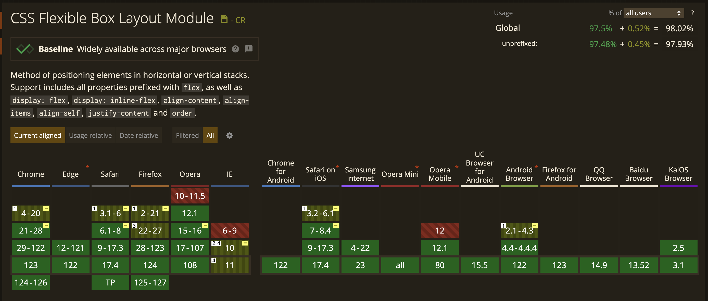
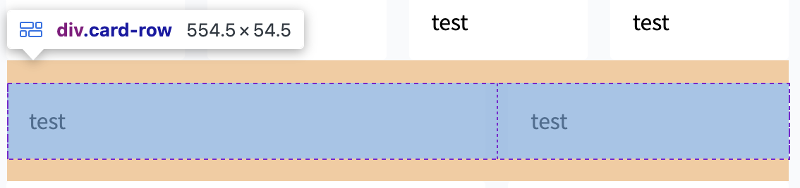
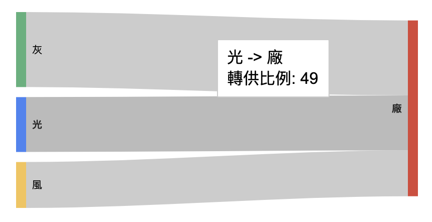
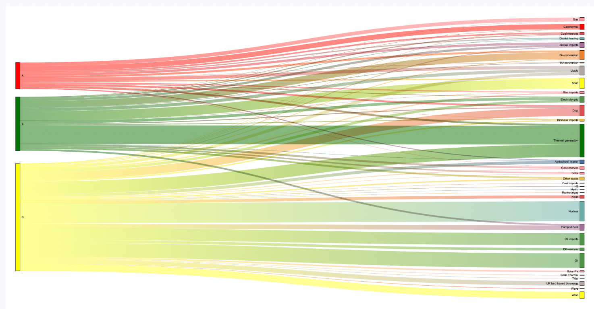
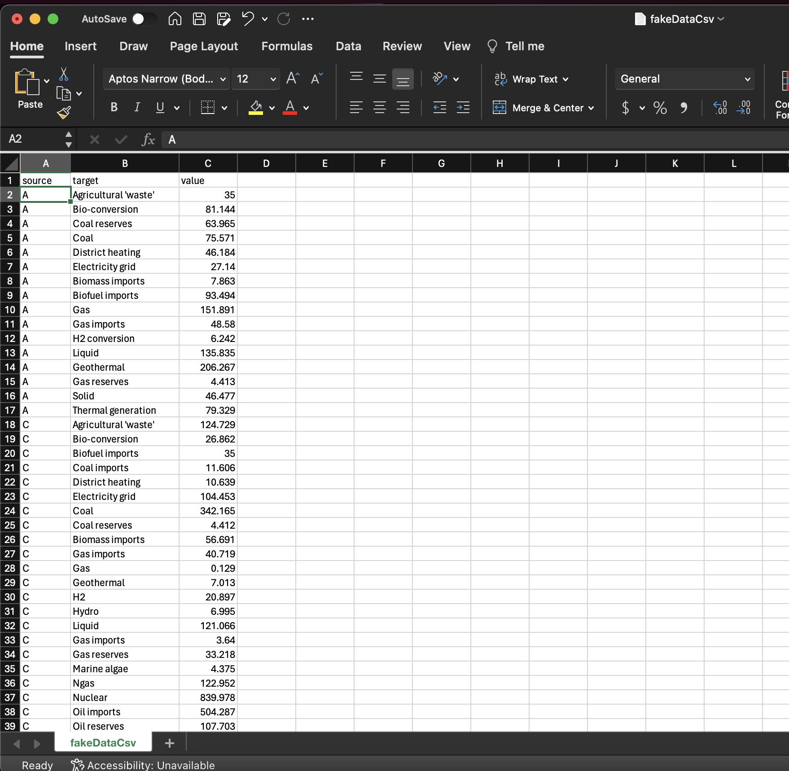
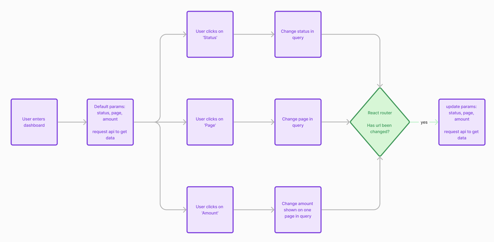
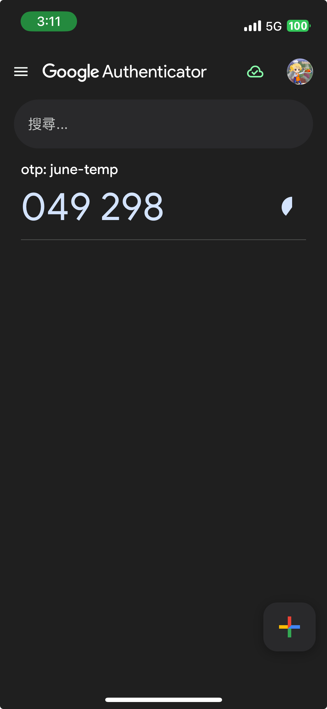

# Auth chart dashboard demo

- ### Demo URL: [https://auth-dashboard-theta.vercel.app/login](https://auth-dashboard-theta.vercel.app/login)


## Run project

```bash
$ yarn dev
```

## Requirements

- [x] <a href="#create-project">create a project using HTML5/SCSS/React JS</a>
- [x] <a href="#responsive">responsive</a>
- [x] simple visual analytics dashboard using Javascript
- [x] <a href="#graphs">statistical graphs with fake data</a>
- [x] <a href="#pages">at least 3 pages in detail in dashboard</a>
- [x] optional tasks:
  - [x] <a href="#data">present transaction matching results</a>
  - [x] <a href="#chart-interaction">chart responsive</a>
  - [x] <a href="#basic-routing">basic routing</a>
  - [x] <a href="#login-mechanism">basic member login mechanism</a>
  - [x] <a href="#multi-factor-authentication">multi-factor authentication</a>

<br/>

## Create project

Using npx instead of npm because npx requires nothing to execute CLI. Npx install packages in a temp space.

```bash
$ npx create-react-app analysis-dashboard-cra
$ cd analysis-dashboard-cra
$ yarn

// modify scripts in package.json to use dev

$ yarn dev
```

Install Sass:

```bash
$ yarn add sass
```

Create `global.scss` in src:

```
- public
- src
  - App.jsx
  - index.js
  - global.scss
```

Import `global.scss` in `index.js`:

```javascript
import "./global.scss";
```

Similar process of other components.

<a href="#requirements">⬆️ Go back to Requirements</a>

<br />

## Responsive


### Using css flex:



### Basic flex:



```html
<div class="card-row">
  <div class="card grow-2">test</div>
  <div class="card">test</div>
</div>
```

```scss
.card-row {
  display: flex;
  align-items: center;
  justify-content: space-between;

  .card {
    flex-grow: 1;

    &.grow-2 {
      flex-grow: 2;
    }
  }
}
```

### Add responsive:

```scss
.card-row {
  ... @media (max-width:768px) {
    flex-direction: column;
  }
}
```

<br />

<a href="#requirements">⬆️ Go back to Requirements</a>

### Folder:

```
...
- pages
 - Dashboard // Dashboard layout
 - Home // 概觀
 - Volumn // 電量
 - Analysis // 分析
 ...
- components
 - Pagination // 頁碼
 - SearchInput // 搜尋輸入匡
```

<a href="#requirements">⬆️ Go back to Requirements</a>

## Graphs

| Data types |
| ---------- |
| JSON       |
| CSV        |

| Chart tools         |
| ------------------- |
| React Google Charts |
| D3                  |

### Sankey

#### Demo 1 - JSON + React Google Charts

```jsx
// src/components/Sankey

import React from "react";
import { Chart } from "react-google-charts";

export const data = [
  ["From", "To", "轉供比例"],
  ["光", "廠", 50],
  ["風", "廠", 70],
  ["灰", "廠", 60],
];

export const options = {};

export function Sankey() {
  return (
    <Chart
      chartType="Sankey"
      width="40%"
      height="200px"
      data={data}
      options={options}
    />
  );
}
```



#### Demo 2 - CSV + D3.js

```jsx
// src/components/SankeyD3

import React, { useState, useRef, useEffect } from "react";
import Papa from "papaparse";

import SankeyFun from "./sankeyFun";
import fakeDataCSV from "./fakeDataCsv.csv";

export default function SankeyD3() {
  const [sankeyData, setSankeyData] = useState([]);
  const svgRef = useRef(null);

  useEffect(() => {
    Papa.parse(fakeDataCSV, {
      download: true,
      header: true,
      dynamicTyping: true,
      complete: (results) => {
        console.log({ results });
        setSankeyData(results.data);
      },
    });
  }, []);

  useEffect(() => {
    if (sankeyData.length > 0) {
      SankeyFun(
        { links: sankeyData, svgRef },
        {
          height: 1000,
          width: 2000,
          nodeGroup: (d) => d.id.split(/\W/)[0], // take first word for color
        }
      );
    }
  }, [sankeyData]);

  return (
    <div className="sankey-chart">
      <svg ref={svgRef} />
    </div>
  );
}
```



#### // src/components/SankeyD3/fakeDataCsv.csv



<a href="#requirements">⬆️ Go back to Requirements</a>

## Pages



### Default url:

```
http://localhost:3000/dashboard/volumn
```

### With query:

```
http://localhost:3000/dashboard/volumn?query=%7E%28page%7E2%7Ecount%7E%275%7Estatus%7E%272%29
```

### useSearchParams + JSURL

Using `useSearchParams()` to parses and serializes the search param value using the JSURL library, which permits anyJavaScript value to be safely URL-encoded.

```jsx
// src/utils/useQueryParam.js

import { useSearchParams } from 'react-router-dom';
import * as JSURL from "jsurl";

const useQueryParam = (key, defaultValue) => {
  let [searchParams, setSearchParams] = useSearchParams();

  ...
  // to setValue:
  let newSearchParams = new URLSearchParams(searchParams);
  newSearchParams.set(key, JSURL.stringify({ ...value, ...newValue }));
  setSearchParams(newSearchParams, { replace: true, ...options });
  ...

  return [value, setValue];
}

```

<a href="#requirements">⬆️ Go back to Requirements</a>

## Data

generate fake data using `@faker-js/faker`

```js
// src/pages/Volumn/fakeData.js

const { faker } = require('@faker-js/faker');

function createRandomUser() {
  return {
    id: faker.string.alpha(10),
    ...
    dashPerc: faker.number.int({ min: 10, max: 100 }),
  };
}

export const generateData = (count) => faker.helpers.multiple(createRandomUser, {
  count,
});
```

```jsx
// src/pages/Volumn/VolumnIndex.jsx

import fakeData from "./fakeData";

const VolumnIndex = () => {
  const [data, setData] = useState([]);

  useEffect(() => {
    // TODO: call api through axios

    setData(fakeData.generateData(count));
  }, [count, page, status]);

  return (
    <section>
      <div>
        <Table data={data.data} />
        <Pagination totalPage={data.totalPage} />
      </div>
    </section>
  );
};
```

<a href="#requirements">⬆️ Go back to Requirements</a>

## Chart interaction

Default setting in React Google Chart.

<a href="#requirements">⬆️ Go back to Requirements</a>

## Basic Routing

Using `React router`

```bash
$ yarn add react-router-dom
```

```js
// src/App.jsx

import { Link, useRoutes } from "react-router-dom";

function App() {
  let router = [
    {
      path: "/login",
      element: <Login />,
    },
    {
      path: "/dashboard",
      element: <Dashboard />,
      children: [
        { index: true, element: <Home /> },
        {
          path: routes.analysis,
          element: <Analysis />,
        },
        {
          path: routes.volumn,
          element: <Volumn />,
          children: [{ index: true, element: <VolumnIndex /> }],
        },
        { path: "*", element: <NoMatch /> },
      ],
    },
    { path: "*", element: <NoMatch /> },
  ];

  let element = useRoutes(router);

  return <>{element}</>;
}

const NoMatch = () => <div />;
```

Able to click back in browser

<a href="#requirements">⬆️ Go back to Requirements</a>

## Login Mechanism

1. If login success, save username to browser Cookie
2. If login fail, user cannot direct to dashboard through typing url
3. If login success, user cannot go back to login page by clicking back in browser
4. Once user click sign out button, browser will clear Cookie of username and cannot go back to dashboard

```jsx
// src/utils/auth.jsx
// src/App.jsx

import {
  Routes,
  Route,
  Link,
  useNavigate,
  useLocation,
  Navigate,
  Outlet,
} from "react-router-dom";
import { fakeAuthProvider } from "./auth";

export default function App() {
  return (
    <AuthProvider>
      <Routes>
        <Route element={<Layout />}>
          <Route path="/" element={<PublicPage />} />
          <Route path="/login" element={<LoginPage />} />
          <Route
            path="/protected"
            element={
              <RequireAuth>
                <ProtectedPage />
              </RequireAuth>
            }
          />
        </Route>
      </Routes>
    </AuthProvider>
  );
}

let AuthContext = React.createContext(null!);

function AuthProvider({ children }) {
  let [user, setUser] = React.useState(null);

  let signin = (newUser, callback) => {
    return fakeAuthProvider.signin(() => {
      setUser(newUser);
      callback();
    });
  };

  let signout = (callback) => {
    return fakeAuthProvider.signout(() => {
      setUser(null);
      callback();
    });
  };

  let value = { user, signin, signout };

  return <AuthContext.Provider value={value}>{children}</AuthContext.Provider>;
}

function useAuth() {
  return React.useContext(AuthContext);
}

function AuthStatus() {
  let auth = useAuth();
  let navigate = useNavigate();

  if (!auth.user) {
    return <p>You are not logged in.</p>;
  }

  return (
    <p>
      Welcome {auth.user}!{" "}
      <button
        onClick={() => {
          auth.signout(() => navigate("/"));
        }}
      >
        Sign out
      </button>
    </p>
  );
}

function RequireAuth({ children }) {
  let auth = useAuth();
  let location = useLocation();

  if (!auth.user) {
    return <Navigate to="/login" state={{ from: location }} replace />;
  }

  return children;
}

```

<a href="#requirements">⬆️ Go back to Requirements</a>

## Multi factor authentication



### Simple browser multi-factor Authentication

```jsx
// src/pages/Login/Login2FA/index.jsx

import React, { useEffect, useState, useRef } from "react";
import { useNavigate, useLocation } from "react-router-dom";
import QRCode from "qrcode";
import { authenticator } from "../../../utils/otplib";

export default function Login2FA() {
  const canvasRef = useRef(null);
  let navigate = useNavigate();
  let location = useLocation();
  const [userSecret, setSecret] = useState(null);
  const [isQrcodeValid, setIsValid] = useState(null);
  const [inputValue, setInputValue] = useState(false);

  useEffect(() => {
    const secret = "KFCTML3YPBRTS3DMKRIWSUDRNREUUNJU";
    setSecret(secret);

    const otpauth = authenticator.keyuri("june-temp", "otp", secret);

    QRCode.toCanvas(canvasRef.current, otpauth, function (error) {
      if (error) {
        console.error(error);
      }
    });
  }, []);

  const onVerify = () => {
    const isValid = authenticator.verify({
      secret: userSecret,
      token: inputValue,
    });
    setIsValid(isValid);

    if (isValid) {
      setTimeout(() => {
        const from = location.state?.from?.pathname || "/dashboard";
        navigate(from, { replace: true });
      }, 500);
    }
  };

  return (
    <div>
      <h2>Use Google authenticator app to scan:</h2>
      <canvas ref={canvasRef} />
      <div>Verify code</div>
      <input type="number" onChange={(e) => setInputValue(e.target.value)} />
      <button onClick={() => onVerify()}>Verify</button>
      {isQrcodeValid !== null && <div>{isQrcodeValid ? "✅" : "❌"}</div>}
    </div>
  );
}
```

```jsx
// src/utils/otplib.jsx

/**
 * otplib-preset-browser
 *
 * Provides fully initialised classes that are targeted
 * for a browser build.
 *
 * Uses:
 *
 * - Base32: 'plugin-base32-enc-dec'
 * - Crypto: 'plugin-crypto-js'
 */
import { createDigest, createRandomBytes } from "@otplib/plugin-crypto-js";
import { keyDecoder, keyEncoder } from "@otplib/plugin-base32-enc-dec";
import { Authenticator } from "@otplib/core";
import buffer from "buffer/";

// @ts-ignore
if (typeof window === "object" && typeof window.Buffer === "undefined") {
  // @ts-ignore
  // var Buffer = require('buffer/').Buffer
  window.Buffer = buffer.Buffer; /* globals buffer */
}

export const authenticator = new Authenticator({
  createDigest,
  createRandomBytes,
  keyDecoder,
  keyEncoder,
});
```
